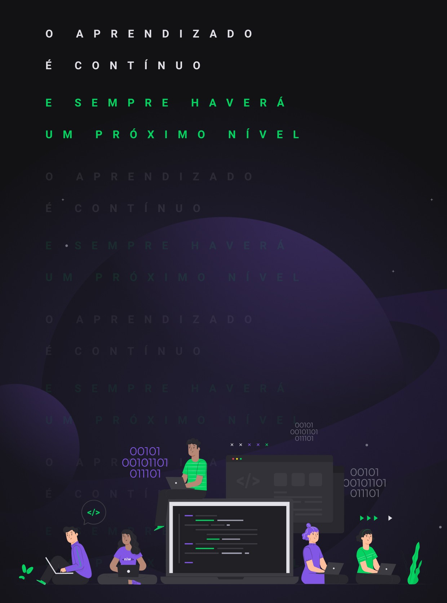
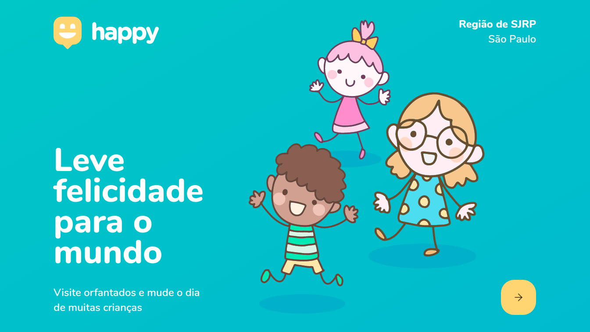

  
  
  

___

<h3 align="center">
  <a href="#information_source-sobre">Sobre</a>&nbsp;|&nbsp;
  <a href="#interrobang-motivo">Motivo</a>&nbsp;|&nbsp;
  <a href="#rocket-tecnologias-utilizadas">Tecnologias</a>&nbsp;|&nbsp;
  <a href="#link-como-contribuir">Como Contribuir</a>&nbsp;|&nbsp;
  <a href="#licença">Licença</a>
</h3>

___

 
 

## :information_source: Sobre

O NLW é um evento online, de duração de uma semana, onde será desenvolvida uma aplicação completa.

Nesta edição a aplicação escolhida foi em homenagem ao dia das crianças. É uma aplicação para localização de orfanatos, onde existem milhares de crianças que precisam de carinho e atenção.

Para o desenvolvimento da aplicação eu escolhi a Região de São José do Rio Preto.

 
 

## :rocket: Tecnologias Utilizadas 

O projeto foi desenvolvido utilizando as seguintes tecnologias

- HTML5
- CSS3
- Javascript
- React
- Typescript

 
 

## :link: Como contribuir 

- Faça um Fork do repositório
- Clone o seu repositório
- Crie uma branch com a sua feature
- Faça um commit com suas mudanças
- 'Push' a sua branch
- Ir em Pull Requests do projeto original e criar uma pull request com o seu commit
 
 

## Licença 

Esse projeto está sob a licença MIT. Veja o arquivo [LICENSE](LICENSE) para mais detalhes.
